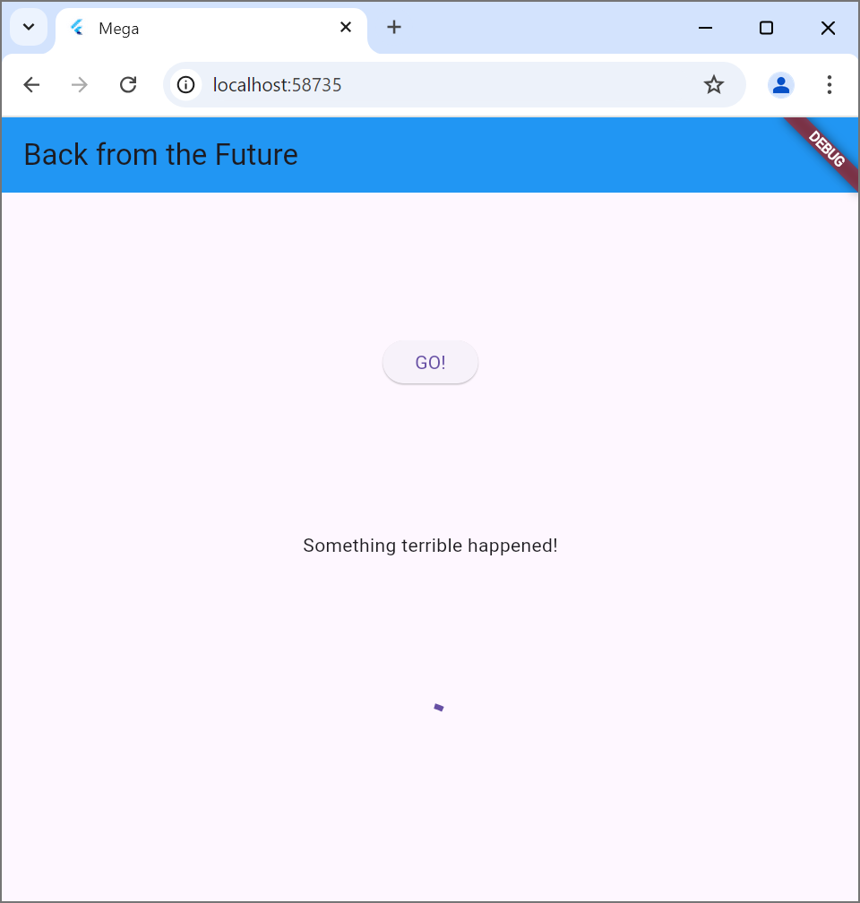
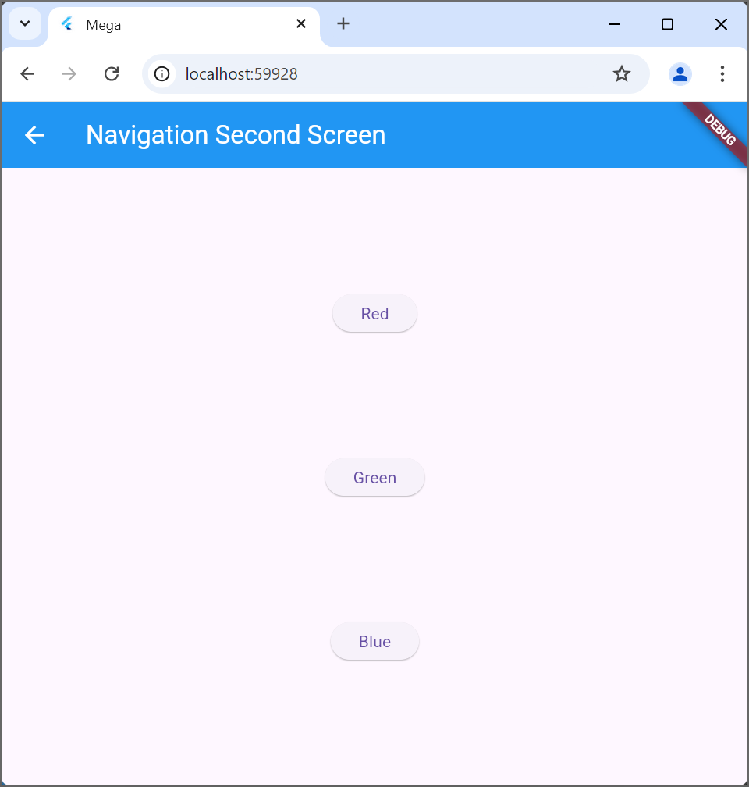

Praktikum 1: Mengunduh data dari Web Service (API)

Soal 1 
Tambahkan nama panggilan pada title app 
Soal 2

Soal 3
Jelaskan maksud kode langkah 5 tersebut terkait substring dan catchError!
jawab: Substring berfungsi memotong string value.body untuk mengambil 450 karakter dengan tujuan untuk menampilkan data api secara ringkas. Sedangkan catchError berfungsi untuk menangani error saat metode getData dijalankan, dan tujuannya untuk mengubah result menjadi pesan error atau memberi tahu pengguna jika ada masalah dalam pengambilan data.

Hasil praktikum:

Praktikum 2: Menggunakan await/async untuk menghindari callbacks
Soal 4 
Jelaskan maksud kode langkah 1 dan 2 tersebut!
jawab: pada langkah 1 yaitu menambahkan tiga method yang berfungsi untuk mengembalikan nilai 1,2,dan 3 menunggu selama 3 detik menggunakan future.delayed dan sifat asynchronous ini tidak langsung mengembalikan hasil karena ada jeda waktu.
Langkah 2 yaitu menambahkan method count() dengan menggunakan ketiga fungsi asynchronous pada langkah 1 untuk menghitung total nilai secara berurutan. Ketika fungsi dijalankan berurutan, maka waktu totalnya adalah 9 detik dan nanti akan menampilkan hasil angka 6

Hasil praktikum:

Praktikum 3: Menggunakan Completer di Future
Soal 5: 
Jelaskan maksud kode langkah 2 tersebut!
jawab: Pada langkah 2 yaitu menambahkan variabel late dan method di class _FuturePageState. Kode tersebut menjalankan proses asynchronous manual menggunakan completer yang dapat memulai dan menyelesaikan future secara terkontrol, dan hasil dari fungsi getNumber akan berupa future yang selesai setelah 5 detik dengan menampilkan nilai 42.
Hasil praktikum:

Soal 6:
Jelaskan maksud perbedaan kode langkah 2 dengan langkah 5-6 tersebut!
jawab: perbedannya antara lain penanganan kesalahan dengan menggunakan try-catch untuk menangani error, sedikit lebih kompleks, dan aman terhadap error yang tidak diduga.

Praktikum 4: Memanggil Future secara paralel
Soal 7:
Hasil praktikum:
Dalam 3 detik akan menampilkan angka 6 lebih cepat dibandingkan dengan praktikum sebelumnya yang menunggu sampai 9 detik

Soal 8:
Jelaskan maksud perbedaan kode langkah 1 dan 4!
jawab: FutureGroup dalam penggunaannya dengan menambahkan future secara bertahap sedangkan future.wait daftar futurenya statis

Praktikum 5: Menangani Respon Error pada Async Code
Soal 9:

Soal 10:

Panggil method handleError() tersebut di ElevatedButton, lalu run. Apa hasilnya? Jelaskan perbedaan kode langkah 1 dan 4!
jawab: then() digunakan untuk menangani hasil dari future dan penanganan error dengan cathError. pola dengan async dan await untuk menangani future, error dapat ditangani dengan blok try-catch.

Praktikum 6: Menggunakan Future dengan StatefulWidget
Soal 11: 
Tambahkan nama panggilan Anda pada tiap properti title sebagai identitas pekerjaan Anda.

Soal 12:
Jika Anda tidak melihat animasi loading tampil, kemungkinan itu berjalan sangat cepat. Tambahkan delay pada method getPosition() dengan kode await Future.delayed(const Duration(seconds: 3));

Apakah Anda mendapatkan koordinat GPS ketika run di browser? Mengapa demikian?

Praktikum 7: Manajemen Future dengan FutureBuilder
Soal 13: 
Apakah ada perbedaan UI dengan praktikum sebelumnya? Mengapa demikian?
jawab: 

Soal 14:
Apakah ada perbedaan UI dengan langkah sebelumnya? Mengapa demikian?
jawab:
memblokir situs ini dari mengakses lokasi, maka akan tampil seperti pada gambar dibawah

Praktikum 8: Navigation route dengan Future Function
Soal 15:
Tambahkan nama panggilan Anda pada tiap properti title sebagai identitas pekerjaan Anda.
Silakan ganti dengan warna tema favorit Anda.

Soal 16:
Cobalah klik setiap button, apa yang terjadi ? Mengapa demikian ?

ketika di klik change color, akan menampilkan 3 button dengan 3 warna yaitu red, green, dan blue

jika button red di klik maka akan tampil seperti gambar dibawah ini:

Gantilah 3 warna pada langkah 5 dengan warna favorit Anda!

Praktikum 9: Memanfaatkan async/await dengan Widget Dialog
Soal 17:
Cobalah klik setiap button, apa yang terjadi ? Mengapa demikian ?

Gantilah 3 warna pada langkah 3 dengan warna favorit Anda!

